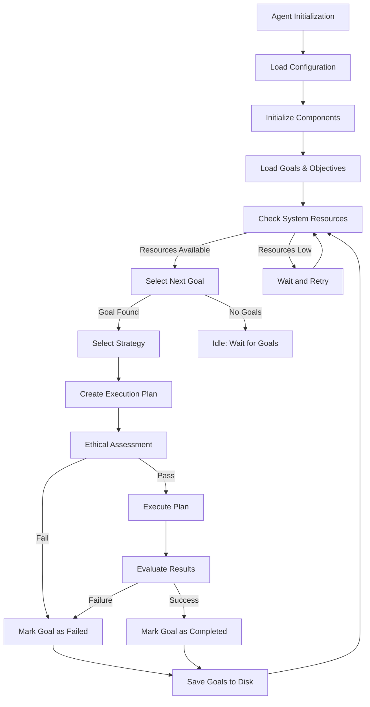

# Borg - Autonomous Self-Improving AI Agent

Borg is an autonomous self-improving AI agent implemented in Rust. It's designed to iteratively generate, modify, and evaluate its own code to improve efficiency, ensure survival, and scale over time.

## Project Status

**Current Version**: 0.1.1

The project is fully implemented with all core components working together. The agent can now run and is ready for defining optimization goals. Major security and production features have been implemented, including:

- ✅ Proper error handling throughout the codebase
- ✅ Secure authentication with bcrypt password hashing and ED25519 signatures
- ✅ Resource monitoring with proper limits and checks
- ✅ Comprehensive logging of all operations
- ✅ Robust Git integration with proper merge handling
- ✅ Code complexity analysis with fallback mechanisms
- ✅ Error handling metric evaluation

## Core Components

- **Code Generation & Modification Engine**: AI-powered module that writes new Rust code or refactors existing code
- **Evaluation & Testing Harness**: Subsystem that executes generated code changes in a sandbox
- **Self-Verification Mechanisms**: Multiple layers of verification to ensure the agent does not introduce regressions
- **Resource Awareness & Survival Strategy**: Monitors system resources and prioritizes changes that improve efficiency
- **Version Control & Autonomous GitOps**: Tracks all code modifications with Git
- **Strategic Planning System**: Manages long-term goals and translates them into actionable milestones and tactical goals
- **Multi-Modal Action Framework**: Enables the agent to interact with external systems through APIs, web research, and system commands
- **Ethics Framework**: Ensures all agent actions adhere to ethical principles
- **Authentication System**: Manages access control and permissions with secure cryptographic methods

## Agent Architecture and Workflow

The Borg agent follows a sophisticated multi-phase workflow to achieve autonomous self-improvement and goal fulfillment. The diagram below shows the agent's core execution flow:



### Key Phases

The agent's workflow consists of several key phases:

1. **Initialization Phase**
   - Load configuration settings
   - Initialize all core components
   - Set up the strategic planning system
   - Register available strategies
   - Load existing goals and objectives from disk

2. **Strategy Selection Phase**
   - Select next goal based on priority and dependencies
   - Evaluate applicable strategies for the goal
   - Choose the best strategy based on relevance scores
   - Verify required permissions for the selected strategy

3. **Planning Phase**
   - Create a detailed execution plan with concrete steps
   - Define step dependencies and parameters
   - Estimate resource requirements
   - Perform ethical assessment of the plan

4. **Execution Phase**
   - Execute each step of the plan in order
   - Track step dependencies and success criteria
   - Collect outputs and metrics for evaluation
   - Pause for confirmation on critical steps

5. **Evaluation Phase**
   - Analyze execution results against goal criteria
   - Run tests to validate changes
   - Update goal status based on results
   - Save progress to disk for persistence

6. **Strategy-Specific Flows**

   **Code Improvement Strategy:**
   ```mermaid
   flowchart TD
       Start[Start Code Improvement] --> AnalyzeGoal[Analyze Goal Requirements]
       AnalyzeGoal --> InitContext[Initialize LLM Context]

       %% Iterative code generation loop
       subgraph IterativeGeneration["Iterative Code Generation Phase"]
           InitContext --> ToolExploration[Explore Codebase Using Tools]
           ToolExploration --> CodeGen[Generate Code Changes]
           CodeGen --> FileUpdates[Update Files]
           FileUpdates --> EvaluateChanges[Evaluate Quality]
           EvaluateChanges --> NeedMore{More Changes<br>Needed?}
           NeedMore -- Yes --> ToolExploration
           NeedMore -- No --> SignalCompletion[Signal Implementation Complete]
       end

       SignalCompletion --> PrepareChanges[Prepare Final Changes]
       PrepareChanges --> CommitToFeatureBranch[Apply Changes to Branch]
       CommitToFeatureBranch --> RunTests[Run Tests]
       RunTests -- Tests Pass --> EvalBenchmarks[Evaluate Benchmarks]
       RunTests -- Tests Fail --> MarkFailed[Mark as Failed]
       EvalBenchmarks -- Meets Criteria --> MergeChanges[Merge Changes]
       EvalBenchmarks -- Fails Criteria --> MarkFailed
       MergeChanges --> MarkCompleted[Mark as Completed]
   ```

   **API Client Strategy:**
   ```mermaid
   flowchart TD
       Start[Start API Interaction] --> Prepare[Prepare Request]
       Prepare --> PermCheck[Permission Check]
       PermCheck -- Allowed --> Execute[Execute API Call]
       PermCheck -- Denied --> Failed[Mark as Failed]
       Execute --> ParseResponse[Parse Response]
       ParseResponse --> ProcessData[Process Data]
       ProcessData --> Complete[Mark as Completed]
   ```

   **Web Research Strategy:**
   ```mermaid
   flowchart TD
       Start[Start Web Research] --> Query[Generate Search Query]
       Query --> Search[Execute Search]
       Search --> FilterResults[Filter Relevant Results]
       FilterResults --> ExtractInfo[Extract Information]
       ExtractInfo --> Synthesize[Synthesize Findings]
       Synthesize --> Integrate[Integrate into Knowledge Base]
       Integrate --> Complete[Mark as Completed]
   ```

7. **Error Recovery Phase**
   - Detect execution failures
   - Roll back changes if necessary
   - Log detailed error information
   - Update goal status

## Multi-Modal Action Framework

The agent uses a flexible strategy-based system to handle different types of actions:

- **Code Improvement**: Generates, tests, and applies code changes
- **API Interaction**: Makes calls to external services
- **Web Research**: Gathers information from the internet
- **System Commands**: Executes commands on the host system
- **Data Analysis**: Processes and analyzes structured data

Each strategy implements the same core interface while providing specialized functionality for its domain, allowing the agent to select the most appropriate approach based on the goal's requirements.

## Production Readiness Progress

The agent is approaching production readiness with several key features implemented:

### Completed Production Features:
- ✅ Proper error handling throughout the codebase
- ✅ Secure authentication with bcrypt password hashing and ED25519 signatures
- ✅ Resource monitoring with proper limits and checks
- ✅ Comprehensive logging of all operations
- ✅ Robust Git integration with proper merge handling
- ✅ Code complexity analysis with fallback mechanisms
- ✅ Error handling metric evaluation

### Pending Production Features:
- ⬜ Database integration for persistent storage
- ⬜ Comprehensive test coverage
- ⬜ Performance optimization
- ⬜ Deployment automation
- ⬜ Monitoring and alerting
- ⬜ Documentation
- ⬜ User interface
- ⬜ API documentation

## Getting Started

### Prerequisites

- Rust (1.70+ recommended)
- Git
- Access to an LLM API (e.g., OpenAI, Anthropic)

### Installation

1. Clone this repository:
   ```
   git clone https://github.com/yourusername/borg.git
   cd borg
   ```

2. Build the project:
   ```
   cargo build
   ```

3. Configure the agent (see Configuration section below)

### Running the Agent

Borg provides a unified command-line interface with various commands:

```
# Run the main agent in autonomous mode
cargo run

# Show information about the agent
cargo run -- info

# Run a single improvement iteration
cargo run -- improve

# List all strategic objectives
cargo run -- objective list

# Add a new strategic objective
cargo run -- objective add <ID> <TITLE> <DESCRIPTION> <TIMEFRAME> <CREATOR>

# Load objectives from a TOML file
cargo run -- load-objectives examples/strategic_objective.toml

# Generate milestones and tactical goals
cargo run -- plan generate

# Show the current strategic plan
cargo run -- plan show

# Generate a progress report
cargo run -- plan report
```

For advanced usage, you can also build the binary and use it directly:

```
cargo build --release
./target/release/borg [COMMAND]
```

## Configuration

The application uses configuration files to manage its settings. For security reasons, your personal configuration with API keys is kept in a separate file that is not committed to the repository.

### Setting Up Configuration

1. The repository includes `config.toml`, which is a template file with placeholder values.

2. For local development, copy this template to a production configuration file:
   ```
   cp config.toml config.production.toml
   ```

3. Edit the `config.production.toml` file and add your API keys:
   ```toml
   # Default LLM configuration
   [llm.default]
   provider = "openai"
   api_key = "your_actual_api_key_here"
   model = "gpt-4o"

   # Additional LLM configurations for specific tasks...
   ```

4. The `config.production.toml` file is automatically ignored by Git to prevent accidentally committing your API keys.

## Roadmap

Please see the [PROGRESS.md](PROGRESS.md) file for detailed information on the project's current status and roadmap.

## License

[MIT License](LICENSE)