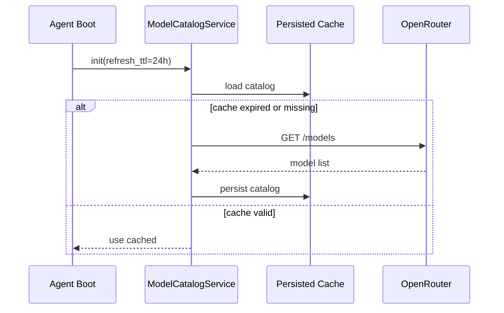
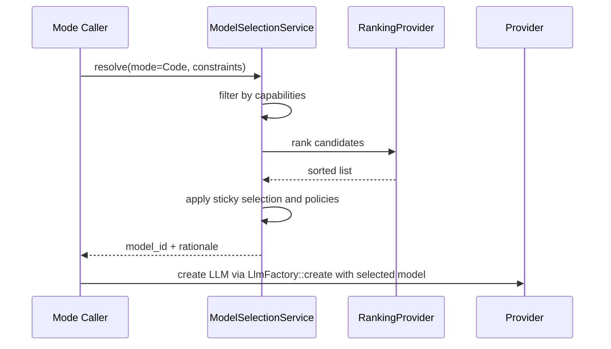

# Dynamic Model Selection via OpenRouter and Ranking Fallback

## 1) Title, Status, Owners, Dates
- Title: Dynamic Model Selection via OpenRouter and Ranking Fallback
- Status: Proposed
- Owners: Borg Core Engineering
- Created: 2025-09-10
- Target Merge: 2025-09-24

## 2) Executive Summary
This RFC specifies a dynamic model selection system that:
- Defaults to OpenRouter for all modes
- Discovers available models from OpenRouter /models at startup and on a TTL schedule
- Filters models by capabilities (tools, reasoning, vision, JSON mode), context limits, latency, and price metadata
- Maps our six modes to model capabilities using sticky selection to minimize churn
- Optionally integrates an external ranking provider (e.g., artificialanalysis.ai) behind an abstraction, falling back to an internal heuristic
- Provides configuration knobs for pinning and overrides, avoiding hard-coded model IDs in configs

This builds on streaming semantics outlined in [docs/rfcs/2025-09-openrouter-streaming.md](docs/rfcs/2025-09-openrouter-streaming.md) and the provider abstraction/mode overhaul in [docs/rfcs/2025-09-multi-provider-llm-and-modes.md](docs/rfcs/2025-09-multi-provider-llm-and-modes.md).

## 3) Background and Current State
- Model is specified statically in LLM configs loaded via [Config::from_file](src/core/config.rs:396); consumers choose a named LLM config at call sites such as [handle_ask_command](src/main.rs:299) and [LlmCodeGenerator::new](src/code_generation/llm_generator.rs:47).
- Provider instantiation is done by [LlmFactory::create](src/code_generation/llm.rs:41).
- There is no capability-driven selection or discovery; configs in [config.toml](config.toml) and [config.production.toml](config.production.toml) use hard-coded model IDs and providers.
- Our new six modes (Orchestrate, Architect, Code, Review, Debug, Ethical assessment) have distinct capability needs and should not be tied to static IDs.

## 4) Goals
- Default to OpenRouter for model routing
- Fetch and cache model catalog from OpenRouter /models with 24h TTL and persisted cache
- Capability-based filtering and ranking to pick a best-fit model per mode
- Sticky selection to avoid flapping between models across runs
- External ranking provider abstraction (optional), internal heuristic as default
- Configuration for pinning, allow/block lists, and per-mode overrides
- Backward compatibility with legacy static configs

Non-goals:
- Changing provider streaming/event semantics (covered by streaming RFC)
- Vendor lock-in to any external ranking provider

## 5) Data Sources and APIs

### 5.1 OpenRouter /models
- Endpoint: GET {api_base}/models (default api_base https://openrouter.ai/api/v1)
- Authentication: Authorization: Bearer ${OPENROUTER_API_KEY}
- Expected fields (subset): id, name, capabilities (tools, vision, reasoning, json), context window, output token max, price (prompt/complete), provider tags, quality/latency metadata
- Errors: HTTP 401/403 (auth), 5xx (server), transient network errors
- Integrates with provider factory [LlmFactory::create](src/code_generation/llm.rs:41) after model resolution

### 5.2 Ranking Provider (optional)
- Abstraction that takes a candidate set and context (mode, capabilities, constraints) and returns a sorted list
- Default implementation: internal heuristic
- Optional external: artificialanalysis.ai via REST, gated by ranking.enabled and API key

## 6) Architecture

### 6.1 Module Structure
- src/model_selection/
  - mod.rs
  - catalog.rs          (fetch, parse, and cache /models)
  - matching.rs         (capability filters and scoring)
  - ranking.rs          (RankingProvider trait, InternalHeuristic, External adapter)
  - policies.rs         (mode policies, sticky selection, fallbacks)
  - persistence.rs      (persisted sticky choices and catalog cache via [src/database/file_db.rs](src/database/file_db.rs))
  - service.rs          (public facade used by callers)

Adapters interact with config loader [Config::from_file](src/core/config.rs:396) and downstream provider creation [LlmFactory::create](src/code_generation/llm.rs:41).

### 6.2 Key Types (internal)
- ModelDescriptor: id, provider, tags, caps {tools, vision, reasoning, json}, limits {prompt_tokens, output_tokens}, price {prompt, completion}, latency_ms_est
- ModeContext: name, requirements, constraints, prefer_json, prefer_reasoning, min_output_tokens, min_prompt_tokens, latency_budget_ms, cost_sensitivity
- SelectionResult: model_id, rationale, scores, timestamp, sticky_until

### 6.3 Sequence

At call time for any mode:

## 7) Capability-Based Filtering

### 7.1 Capability Dimensions
- Tools/function-calling support
- JSON mode support
- Reasoning/thinking support
- Vision inputs support
- Token limits: prompt/context and output
- Price: prompt/response cost
- Latency: historical or advertised

### 7.2 Mapping Heuristics
- Use OpenRouter fields where available; otherwise infer by model family name
- If a dimension is unknown, do not exclude unless required by mode policy; apply penalty instead
- Use safe defaults: assume no tools unless explicitly supported for tool-critical modes

## 8) Mode-to-Model Policies
Define per-mode requirements and preferences.

- Orchestrate:
  - Required: none
  - Preferred: low latency, low cost, JSON mode helpful
  - Min prompt tokens: 8k
  - Weighting: latency high, cost medium, quality medium

- Architect:
  - Required: large context window
  - Preferred: reasoning, high quality
  - Min prompt tokens: 32k, min output 2k
  - Weighting: quality high, context high, latency medium

- Code:
  - Required: tools/function-calling
  - Preferred: JSON mode, high output tokens
  - Min output tokens: 4k
  - Weighting: tools required, quality high, output capacity high

- Review:
  - Required: none
  - Preferred: low latency, cost-efficient
  - Weighting: latency high, cost high, quality medium

- Debug:
  - Required: tools preferred (not strictly required), large context helpful
  - Weighting: context medium, tools high, latency medium

- Ethical assessment:
  - Required: none
  - Preferred: reasoning support, determinism (lower temperature)
  - Weighting: quality high, reasoning high

Policy engine lives in src/model_selection/policies.rs.

## 9) Sticky Selection
- Maintain last chosen model per mode to reduce churn
- Persisted in file DB with sticky_ttl (default 7 days)
- Stickiness broken when:
  - Pin overrides are present
  - Model removed or degraded (capability no longer meets hard requirements)
  - Error rate or outages detected for the model/provider
- Sticky map path persisted via [src/database/file_db.rs](src/database/file_db.rs)

## 10) Ranking Provider Abstraction

### 10.1 Trait
- trait RankingProvider
  - fn rank(&self, candidates: &[ModelDescriptor], ctx: &ModeContext) -> Vec<ScoredModel>

### 10.2 Implementations
- InternalHeuristic:
  - Weighted scoring by policy: capability fit, context coverage, cost, latency, quality tag
  - Deterministic and offline
- External adapter (optional):
  - Config: ranking.enabled=true, ranking.provider="artificialanalysis", env ANALYSIS_API_KEY
  - If network error or 429, fall back to InternalHeuristic

Module: src/model_selection/ranking.rs.

## 11) Configuration

### 11.1 New Sections
- [model_selection]
  - provider = "openrouter"  # default
  - refresh_ttl_seconds = 86400
  - sticky_ttl_seconds = 604800
  - enabled = true
- [model_selection.pins]
  - code = "openrouter/auto"           # or explicit model ID
  - review = ""
  - architect = ""
  - debug = ""
  - ethical_assessment = ""
  - orchestrate = ""
- [model_selection.allowlist]
  - models = []   # optional restrict to subset
- [model_selection.blocklist]
  - models = []   # exclude specific models
- [ranking]
  - enabled = false
  - provider = "internal"
  - external = { provider = "artificialanalysis", api_key = "${ANALYSIS_API_KEY}" }

### 11.2 Backward Compatibility
- If llm.<name>.model is explicitly set (non-empty), dynamic selection is bypassed for that entry
- Legacy keys (llm.planning, llm.code_generation, llm.ethics, llm.code_review) map to new modes via migration rules in [docs/rfcs/2025-09-multi-provider-llm-and-modes.md](docs/rfcs/2025-09-multi-provider-llm-and-modes.md)
- Default provider is OpenRouter when unspecified (as long as OPENROUTER_API_KEY is present); otherwise fallback to existing provider entries

### 11.3 Feature Flag Interplay
- openai.use_responses_api=true influences payload mapping (see RFC 1); model selection returns OpenRouter model id; downstream OpenAI-specific flags apply only when provider is openai

## 12) Service Integration Points

- Agent boot (config loaded via [Config::from_file](src/core/config.rs:396)):
  - Initialize ModelCatalogService with TTL and persistence
- Ask CLI path [handle_ask_command](src/main.rs:299):
  - Before provider creation, resolve model for mode=Orchestrate or default; replace llm_config.model with selected id
- Codegen and Planning:
  - Codegen path [LlmCodeGenerator::new](src/code_generation/llm_generator.rs:47) and planning calls [StrategicPlanningManager::generate_strategic_plan_with_llm](src/core/planning.rs:582) should request a model resolution for their respective modes before creating providers
- Provider factory remains unchanged externally: [LlmFactory::create](src/code_generation/llm.rs:41)

## 13) Fallback Behaviors

- Catalog fetch failure:
  - Use last persisted catalog; if missing, allow static model if present; else select a conservative default ("openrouter/auto") and log warn
- Sticky selection invalidated:
  - Re-run ranking and pick next best
- Missing capabilities:
  - If a required capability is missing (e.g., tools for Code), skip candidate
- Token budget constraints:
  - If min output tokens exceed model limit, penalize or exclude; adhere to token accounting in RFC 1
- Provider unavailable:
  - Mark model temporarily degraded; increase backoff; choose next best

## 14) Observability

Structured logs:
- On refresh: model count, TTL, source (cache/network), errors
- On selection: mode, candidates considered, top N scores, chosen model, rationale, sticky state
- On fallback events

Minimal metrics:
- model_catalog_refresh_total{source}
- model_selection_total{mode}
- model_selection_sticky_used_total{mode}
- model_selection_fallback_total{reason}

## 15) Testing Strategy

### 15.1 Unit Tests
- Filters:
  - Require tools for Code; ensure non-tool models excluded
  - Reasoning preference for Architect; ensure reasoning-capable models ranked higher
- Scoring:
  - Verify cost and latency weights influence ranking as configured
- Sticky:
  - Selection remains stable across runs within sticky_ttl unless invalidated

### 15.2 Integration Tests (Mocked HTTP)
- Mock /models response with:
  - Mixed capabilities, different context limits and costs
  - Missing fields and partial metadata
- Validate:
  - Catalog persisted and loaded from [src/database/file_db.rs](src/database/file_db.rs)
  - TTL enforcement: older cache triggers network refresh
  - Selection flow returns expected model per mode

### 15.3 Golden Tests
- Provide synthetic catalogs ensuring deterministic selection for each mode
- Include a case that triggers fallback on missing required capability

### 15.4 CLI Tests
- Default provider is OpenRouter when configs omit provider
- Pin overrides respected (e.g., [model_selection.pins] code="some-model")
- Legacy configs load and map to new modes without breaking Ask/Plan/Improve flows tested in [tests/cli_test.rs](tests/cli_test.rs)

### 15.5 Regression: OpenAI max_tokens vs max_output_tokens
- When a selected model resolves to OpenAI Responses family (via OpenRouter metadata or direct OpenAI config), ensure request uses max_output_tokens per RFC 1 fallback logic
- Simulate HTTP 400 error with message "Unsupported parameter: 'max_tokens'..." and verify automatic retry switches parameter name and endpoint once

## 16) File-by-File Change Plan

Phase A: Foundations
- Create model_selection modules:
  - [src/model_selection/mod.rs](src/model_selection/mod.rs)
  - [src/model_selection/catalog.rs](src/model_selection/catalog.rs)
  - [src/model_selection/matching.rs](src/model_selection/matching.rs)
  - [src/model_selection/ranking.rs](src/model_selection/ranking.rs)
  - [src/model_selection/policies.rs](src/model_selection/policies.rs)
  - [src/model_selection/persistence.rs](src/model_selection/persistence.rs)
  - [src/model_selection/service.rs](src/model_selection/service.rs)
- Persistence uses [src/database/file_db.rs](src/database/file_db.rs)

Phase B: Integration
- Agent startup in [src/main.rs](src/main.rs):
  - Initialize and warm catalog on boot (non-blocking behind a short timeout)
- Ask CLI path [handle_ask_command](src/main.rs:299):
  - Resolve model with mode=Orchestrate/default before calling [LlmFactory::create](src/code_generation/llm.rs:41)
- Codegen and Planning:
  - Resolve model with mode=Code in [LlmCodeGenerator::new](src/code_generation/llm_generator.rs:47)
  - Resolve model with mode=Architect in [StrategicPlanningManager::generate_strategic_plan_with_llm](src/core/planning.rs:582)

Phase C: Config and Flags
- Add [model_selection] and [ranking] sections to config schema loader in [src/core/config.rs](src/core/config.rs)
- Migration logs: deprecate legacy role keys; map to modes (RFC 1)

Phase D: Tests
- Add tests/model_selection_catalog_tests.rs (mocked HTTP)
- Add tests/model_selection_golden_tests.rs
- Add CLI tests for default OpenRouter and pin overrides

## 17) Security and Ethics
- Keys loaded from env: OPENROUTER_API_KEY; external ranking key ANALYSIS_API_KEY when enabled
- Do not log secrets; redact Authorization headers
- Backoff and jitter for /models on 429/5xx; cache last-good catalog
- Ethical assessment mode remains auditable as in RFC 1; selection decisions logged with rationale

## 18) DoD Alignment
- End-to-end flow: model discovery, cache, selection, sticky, integration at all call sites
- Unit and integration tests for selection logic and fallbacks
- Documentation: this RFC, cross-ref RFC 1 and streaming RFC
- Observability: structured logs and minimal metrics
- CI linting unchanged

## 19) Addendum to Streaming RFC
No streaming changes are required; however, selection policies should annotate chosen capabilities and context limits in logs at provider creation time to ease debugging, complementing the behavior described in [docs/rfcs/2025-09-openrouter-streaming.md](docs/rfcs/2025-09-openrouter-streaming.md).

## 20) Open Questions and Assumptions
- Capability metadata completeness: OpenRouter fields may be missing across some upstream models; heuristics and penalties will handle ambiguity rather than strict exclusion
- Price/latency normalization: treat missing as neutral; prefer lower cost but never at the expense of required capabilities
- Sticky invalidation signals: initially only based on capability mismatch and outages; future: incorporate error rates
- External ranking provider schema variance: design adapter resilient to format changes and sandbox behind flags