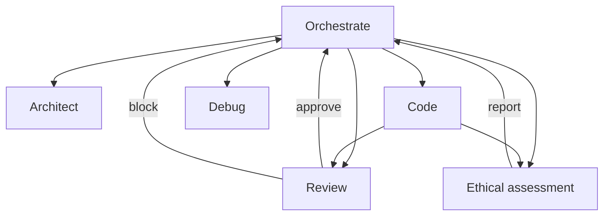

# Modes v2: Implementation Plan and Migration

## 1) Title, Status, Owners, Dates
- Title: Modes v2: Orchestrated Execution with Six Modes
- Status: Proposed
- Owners: Borg Core Engineering
- Created: 2025-09-10
- Target Merge: 2025-09-24

## 2) Executive Summary
This RFC introduces six execution modes (Orchestrate, Architect, Code, Review, Debug, Ethical assessment) and retires legacy roles (code_generation, planning, ethics, code_review) with backward compatibility.
It defines a ModeRunner trait, a central ModeDispatcher, per-mode I/O contracts, config schema changes, CLI routing, ethical guideline enforcement with auditable reports, observability, and a phased migration behind a feature flag modes.v2_enabled.
Providers default to OpenRouter and model selection integrates with [ModelSelectionService::select_for_intent()](src/model_selection/service.rs:379) using [ModeIntent](src/model_selection/policy.rs:8).

## 3) Background and Current State
- Strategy-based execution exists via [Strategy](src/core/strategy.rs:145) with CodeImprovement as the primary strategy; planning and ethics are separate subsystems.
- CLI loads config with OpenRouter-default behavior already integrated and runtime snapshot set in [main](src/main.rs:153).
- Dynamic model selection service and policy weights exist, with intents defined in [policy](src/model_selection/policy.rs:8).
- Legacy role-specific llm keys are still referenced in call sites, e.g., code generation preference in [Agent::new](src/core/agent.rs:102) and Ask selection in [handle_ask_command](src/main.rs:312).

## 4) Goals
- Introduce six modes with strict responsibilities and I/O boundaries.
- Replace legacy roles with backward compatible shims and config migration.
- Central dispatcher that routes tasks to per-mode runners and enforces guardrails.
- Ethical assessment as a first-class mode producing auditable reports.
- Mode-aware model selection via OpenRouter catalog and policy mapping.
- No breaking CLI changes; legacy flags/config keys warn and map.

Non-goals:
- Changing provider streaming semantics (covered by [2025-09-openrouter-streaming](docs/rfcs/2025-09-openrouter-streaming.md)).
- Altering existing tests beyond adding coverage for modes and migration.

## 5) Mode Definitions and Responsibilities
- Orchestrate: task decomposition, dependency graphing, subtask spawning, progress collation, error escalation.
- Architect: high-level planning, specs, acceptance criteria, constraints, interfaces.
- Code: implementation execution, code edits, diffs, adherence to repo rules, tool invocations.
- Review: critical code review, style/lint/security checks, actionable feedback, approve/block decision.
- Debug: systematic troubleshooting, hypothesis generation, experiment/logging diffs, root-cause analysis.
- Ethical assessment: check goals/objectives and artifacts against ethical guidelines; produce compliance report and recommendations.

### 5.1 Per-mode I/O Contracts
- Common input envelope:
  - mode: one of {orchestrate, architect, code, review, debug, ethical}
  - request_id: UUID
  - goal_id or task_id
  - context: structured context including workspace snapshot, constraints, and prior artifacts
  - permissions: computed capabilities and allowed tools
- Common output (ModeResult):
  - success: bool
  - artifacts: typed list (e.g., CodeDiffs, ReviewFindings, EthicalReport, PlanDocs, DebugLogs)
  - logs: structured steps and decisions
  - decisions: approve/block, escalate, or next-step proposals
  - metrics: counters and timings

## 6) Internal Mode trait and boundaries
- Define [ModeRunner::run()](src/core/strategy.rs:1) and ModeResult in [src/core/strategy.rs](src/core/strategy.rs:1) or a new [src/modes/mod.rs](src/modes/mod.rs) module. Trait shape:
- ModeRunner::name() -> &str
- ModeRunner::capabilities() -> ModeCapabilities
- ModeRunner::run(ctx: ModeContext) -> ModeResult
- ModeContext: Config snapshot, working_dir, I/O channels, model selection handle, tool/FS permissions
- ModeResult: as defined above; include an optional 'decision' field for Review/Ethical

We will keep [Strategy](src/core/strategy.rs:145) intact for now and introduce ModeRunner alongside it. Orchestrate will be the entry point for top-level flows, while CodeImprovementStrategy remains callable by the Code mode runner.

## 7) Orchestration topology
- Add a central dispatcher [src/core/mode_dispatcher.rs](src/core/mode_dispatcher.rs) that:
  - Resolves provider/model via [ModelSelectionService::select_for_intent()](src/model_selection/service.rs:379).
  - Enforces per-mode permissions (e.g., only Code modifies files; Review and Ethical are read-only with logging).
  - Spawns child tasks when Orchestrate delegates to other modes and collates results.
  - Implements a circuit breaker on repeated failures per task_id to avoid infinite loops.

Mermaid topology


Tooling permissions
- Orchestrate: read/write plan artifacts; no file edits; can spawn child modes.
- Architect: write docs under docs/; no code writes.
- Code: allowed to write under workspace with version control via [GitManager](src/version_control/git.rs:1).
- Review: read-only; writes review artifacts under logs/review/.
- Debug: can write temporary logs under logs/debug/; no code writes unless explicitly permissioned.
- Ethical: read-only; writes reports under logs/ethics/.

## 8) Config schema changes in [src/core/config.rs](src/core/config.rs:1)
Add a new modes.* section:
```toml
[modes]
v2_enabled = true

[modes.orchestrate]
enabled = true

[modes.architect]
model_policy = "auto"
provider = "openrouter"

[modes.code]
model_policy = "auto"
tools_required = true

[modes.review]
model_policy = "auto"

[modes.debug]
model_policy = "auto"
reasoning_preferred = true

[modes.ethical]
model_policy = "auto"
strict = true
```

Loader behavior:
- Extend Config with a ModesConfig struct and load these sections.
- Backward-compat mapping on load:
  - llm.default remains; llm.code_generation, llm.code_review, llm.planning, llm.ethics map to [modes.code], [modes.review], [modes.architect], [modes.ethical] respectively.
- Emit warn-level deprecation logs when legacy keys are found.
- Set runtime model selection snapshot with [set_runtime_model_selection_from](src/core/config.rs:739) as today.

Model policy integration:
- Dispatcher calls [ModelSelectionService::select_for_intent()](src/model_selection/service.rs:379) with [ModeIntent](src/model_selection/policy.rs:10) mapped:
  - orchestrate -> Orchestrate
  - architect -> Architect
  - code -> Code
  - review -> Review
  - debug -> Debug
  - ethical -> Ethical

## 9) CLI UX and migration
- No breaking changes to commands in [src/main.rs](src/main.rs:33).
- Default flows map to modes when modes.v2_enabled=true:
  - None/default: Orchestrate top-level loop triggers Architect→Code→Review→Ethical as needed.
  - Improve: Orchestrate single-iteration pipeline.
  - Plan generate/show/report: Architect-mode artifacts; Review/Ethical optional.
  - Ask: treated as Orchestrate request with streaming preserved via [handle_ask_command](src/main.rs:302).
- Legacy flags/names:
  - References to planning, code_generation, code_review, ethics in config cause deprecation warnings and are mapped to new modes at load.
- Deprecation schedule:
  - Release N: introduce modes.v2_enabled and mapping with warn logs.
  - Release N+1: escalate to warn+once per run; document migration.
  - Release N+2: remove legacy keys; fail with actionable error if still present.

## 10) Ethical guidelines integration
- Ethical mode enforces a checklist aligned with [.roo/rules/coding-rules.md](.roo/rules/coding-rules.md):
  - Safety and privacy checks (PII, secrets, logs redaction).
  - IP/license compliance for new content and dependencies.
  - Harmful content avoidance and misuse prevention.
  - Data handling and logging redaction compliance with provider headers.
  - Documentable decisions with reproducible evidence (links to diffs/tests).
- Output artifacts:
  - EthicalReport JSON and markdown stored under logs/ethics/{task_id}/.
  - Structured fields: request_id, goal_id, risk_level, is_approved, approval_justification, principle_impacts[], mitigations[], evidence[].
- Implementation notes:
  - Reuse [EthicsManager](src/core/ethics.rs:211) for scoring and history.
  - Provide a [Review/Ethical] decision in ModeResult; Orchestrate must block downstream Code merges when Ethical returns is_approved=false or risk_level >= High.

## 11) Observability
- Structured logging across all modes:
  - mode, request_id, intent, provider, model, timings, child_tasks, decision.
- Metrics (no-op by default):
  - counters: mode_invocations_total{mode}, mode_failures_total{mode}, mode_retries_total{mode}
  - histograms: mode_latency_ms{mode}
- Logs for model selection already include candidates and sticky info per [service](src/model_selection/service.rs:312).

## 12) File-by-file change plan
Add new modules:
- [src/modes/mod.rs](src/modes/mod.rs)
- [src/modes/orchestrate.rs](src/modes/orchestrate.rs)
- [src/modes/architect.rs](src/modes/architect.rs)
- [src/modes/code.rs](src/modes/code.rs)
- [src/modes/review.rs](src/modes/review.rs)
- [src/modes/debug.rs](src/modes/debug.rs)
- [src/modes/ethical.rs](src/modes/ethical.rs)

Dispatcher:
- [src/core/mode_dispatcher.rs](src/core/mode_dispatcher.rs) with factory and routing from [src/core/agent.rs](src/core/agent.rs:27) and [src/main.rs](src/main.rs:136).

Update loader and shims:
- Extend [src/core/config.rs](src/core/config.rs:1) to parse [modes.*] and map legacy llm.* with deprecation logs.
- Replace direct uses in [src/core/planning.rs](src/core/planning.rs:1) and [src/core/ethics.rs](src/core/ethics.rs:1) with calls into mode dispatcher; retain thin shims for backward compat.

Provider selection:
- Use [ModelSelectionService::select_for_intent](src/model_selection/service.rs:379) mapping per mode to [ModeIntent](src/model_selection/policy.rs:10).

Tests:
- Add tests/modes_dispatcher.rs to verify routing and permissions.
- Add tests/modes_code_io.rs, tests/modes_review_io.rs, tests/modes_ethical_io.rs, tests/modes_debug_io.rs.
- Add integration tests covering orchestrate→code/review/ethical with mocks.

## 13) Test strategy and matrix
Unit tests:
- Mode runners return expected ModeResult for given inputs.
- EthicalReport generation and guideline enforcement paths.
- Dispatcher selects correct runner; permissions enforced.

Integration tests (mocked I/O and HTTP):
- Dispatcher chooses model via policy auto; no network calls when selection disabled.
- CLI-level: legacy flags route to new modes; deprecation warnings present.

CLI smoke tests:
- Ask streaming unaffected; selection invoked for Orchestrate when enabled.
- Improve flows run through Orchestrate.

## 14) Migration sequence and feature flags
- Phase 0: Land scaffolding behind modes.v2_enabled=false default.
- Phase 1: Introduce ModeRunner trait, dispatcher, and stubs for each mode.
- Phase 2: Wire CLI and Agent to dispatcher when modes.v2_enabled=true.
- Phase 3: Implement per-mode runners incrementally; start with Review and Ethical (read-only), then Architect, then Code, finally Debug.
- Phase 4: Add config loader mapping and warn logs; documentation and examples.
- Phase 5: Enable in CI for tests only; default remains off.
- Phase 6: Flip default to true after soak testing; remove legacy shims in N+2.

## 15) Legacy-to-new mapping
- llm.code_generation  -> modes.code
- llm.planning         -> modes.architect
- llm.ethics           -> modes.ethical
- llm.code_review      -> modes.review
- Unspecified default  -> orchestrate intent via LegacyDefault policy until modes.v2_enabled=true

## 16) Security and auditability
- Ethics mode artifacts stored under logs/ethics/ with request_id folders.
- Redact secrets; never log Authorization headers; see provider headers in [LlmConfig](src/core/config.rs:86).
- Orchestrate refuses to continue when Ethical decision is block or when risk_level is High unless override flag is set and logged.

## 17) Definition of Done
- End-to-end mode replacement with dispatcher shims, docs updated, tests passing.
- Observability fields present in logs.
- Backward compatibility: legacy keys mapped with warnings; CLI unchanged.
- Providers default to OpenRouter; selection policy auto works for each mode.

## 18) Open questions
- Where to persist per-mode artifacts: use logs/<mode>/ by default; later consider database.
- Whether to unify Strategy and ModeRunner long term: initially coexist; evaluate consolidation after stabilization.