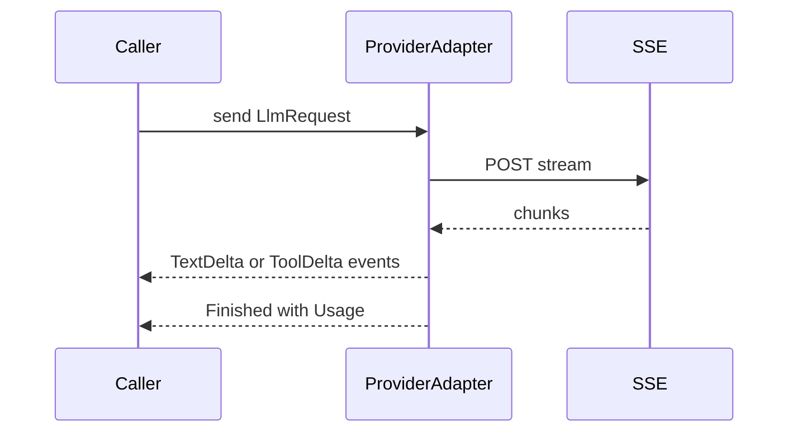
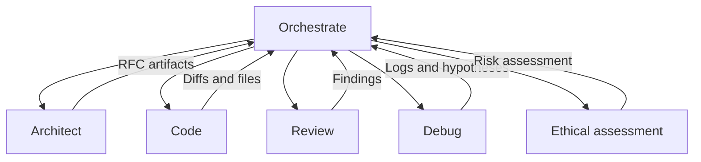

# Multi-Provider LLM Integration and Parameter Mapping

## 1) Title, Status, Owners, Dates
- Title: Multi-Provider LLM Integration and Parameter Mapping
- Status: Proposed
- Owners: Borg Core Engineering
- Created: 2025-09-10
- Target Merge: 2025-09-24

## 2) Executive Summary
This RFC specifies a unified provider abstraction and complete parameter mapping for OpenRouter, OpenAI, and Anthropic, including streaming, tool calling, error normalization, and token controls. It also defines the mode overhaul to six execution modes and a backward compatible configuration migration from legacy roles. It directly addresses the regression reported by OpenAI: Unsupported parameter: 'max_tokens' is not supported with this model. Use 'max_completion_tokens' instead.

Related work: see [docs/rfcs/2025-09-openrouter-streaming.md](docs/rfcs/2025-09-openrouter-streaming.md) for prior streaming semantics. This RFC proposes addenda rather than rewriting that document.

## 3) Problem Statement
- Our provider layer assumes uniform parameters, sending max_tokens to all OpenAI endpoints via [OpenAiProvider::generate()](src/code_generation/llm.rs:96) and [OpenAiProvider::generate_streaming()](src/code_generation/llm.rs:243), which fails on the Responses API that requires max_output_tokens or max_completion_tokens.
- Tool calling and streaming event shapes differ across providers and are not normalized.
- Errors from providers are surfaced as opaque strings via [BorgError::LlmApiError](src/core/error.rs:11), losing category information.
- Legacy role keys (code_generation, planning, ethics, code_review) need to be replaced by six modes without breaking CLI UX or tests that currently rely on defaults in [src/main.rs](src/main.rs) and strategies in [src/core/strategy.rs](src/core/strategy.rs).

## 4) Goals
- Single internal LLM contract covering messages, images, tools, system prompt, sampling params, response_format and JSON mode, and token controls.
- Correct parameter mapping for: OpenAI Chat Completions, OpenAI Responses, Anthropic Messages, OpenRouter passthrough.
- Unified streaming over SSE and HTTP with explicit event typing and safe teardown.
- Normalized tool calling with queued execution and tool_choice controls.
- Error normalization with typed categories.
- Token accounting and headroom policies to prevent truncation and avoid endpoint-specific parameter regressions.
- Replace legacy roles with six modes and migrate configuration.

Non-goals:
- UI changes beyond current CLI behavior in [handle_ask_command](src/main.rs:299).
- Changing the testing runner behavior beyond adding new tests.

## 5) Product Decisions (confirmed)
- Default provider: OpenRouter for all modes.
- Env vars: OPENROUTER_API_KEY, OPENAI_API_KEY, ANTHROPIC_API_KEY.
- OpenAI Responses API: behind feature flag openai.use_responses_api=true (default off). When enabled, use automatic endpoint selection and fallback.
- Model catalog TTL: 24h with persisted cache using [src/database/file_db.rs](src/database/file_db.rs) plus in-memory.
- Ranking provider: abstraction defined; default internal heuristic only.

## 6) Architecture Overview
The new provider abstraction introduces a single internal request and response contract decoupled from provider payloads. Providers implement an adapter that maps to their native APIs and streaming formats.

### 6.1 Internal request contract
Proposed module: [llm::contract](src/code_generation/llm.rs) add submodule in a new file [src/code_generation/contract.rs](src/code_generation/contract.rs)

Types:
- LlmRequest
  - messages: Vec<MessagePart> where each is role plus segmented content parts
  - system: Option<String>
  - tools: Vec<ToolSpec>
  - tool_choice: ToolChoice = Auto|Required|None
  - temperature: Option<f32>, top_p: Option<f32>, stop: Option<Vec<String>>, seed: Option<u64>
  - presence_penalty, frequency_penalty: Option<f32>
  - logit_bias: Option<HashMap<String, f32>>
  - response_format: Option<ResponseFormat> with Json or Text
  - json_mode: bool
  - max_output_tokens: Option<usize>  Note: internal canonical name is max_output_tokens
  - metadata: Map for provider hints

- MessagePart
  - role: system|user|assistant|tool
  - content: Vec<ContentPart> where ContentPart::Text, ::ImageUrl, ::ToolResult

- ToolSpec
  - name: String, description: String, parameters: JSON Schema-like map, strict: bool

- ToolCallNormalized
  - id: String, name: String, arguments_json: String

- LlmResponse
  - content: String
  - tool_calls: Vec<ToolCallNormalized>
  - usage: TokenUsage { input: u32, output: u32, total: u32 }
  - stop_reason: Option<String>
  - request_id: Option<String>

### 6.2 Provider adapters and placement
- OpenAI adapter file: [src/providers/openai.rs](src/providers/openai.rs) wrapping existing [OpenAiProvider](src/code_generation/llm.rs:59)
- Anthropic adapter file: [src/providers/anthropic.rs](src/providers/anthropic.rs) wrapping [AnthropicProvider](src/code_generation/llm.rs:462)
- OpenRouter adapter file: [src/providers/openrouter.rs](src/providers/openrouter.rs) wrapping [OpenRouterProvider](src/code_generation/llm.rs:805)
- Shared streaming utilities: [src/providers/streaming.rs](src/providers/streaming.rs), emitting typed events
- Error normalization: [src/core/error.rs](src/core/error.rs) add variants

### 6.3 Invocation points
- Codegen: [LlmCodeGenerator](src/code_generation/llm_generator.rs:23) uses the provider via factory; no behavior change at call sites but receives normalized errors and usage.
- Planning: [StrategicPlanningManager::generate_strategic_plan_with_llm](src/core/planning.rs:582), [StrategicPlanningManager::generate_milestones_for_objective](src/core/planning.rs:763) use buffered streaming per RFC.
- Ask CLI: [handle_ask_command](src/main.rs:299) continues to stream tokens to stdout when requested.

## 7) Parameter Mapping
Canonical internal fields map to provider parameters as follows.

### 7.1 OpenAI Chat Completions
- Endpoint: POST /v1/chat/completions
- Tokens: internal max_output_tokens -> max_tokens
- Messages: as chat messages
- Tools: tools[], tool_choice
- Response format: response_format: { type: json_object } for JSON mode
- Streaming: stream=true; parse choices[0].delta.content and tool_calls deltas

### 7.2 OpenAI Responses API
- Endpoint: POST /v1/responses
- Tokens: internal max_output_tokens -> max_output_tokens (alias max_completion_tokens if required by model variant)
- Input: messages converted to input schema blocks with role and content parts
- Tools: tools, tool_choice identical conceptually
- Streaming: stream=true via SSE; messages[].delta or output_text delta

Detection logic and fallback:
- If feature flag openai.use_responses_api=false, use Chat Completions unconditionally.
- If true, choose endpoint by model family heuristic:
  - Prefer Responses for models starting with gpt-4.1, gpt-4o, o4, or future Responses-only families.
  - Otherwise Chat Completions.
- On HTTP 400 with error stating Unsupported parameter: 'max_tokens' is not supported..., retry once by switching endpoint and mapping to max_output_tokens.
- Cache the successful endpoint per model for 24h to avoid repeated retries.

### 7.3 Anthropic Messages
- Endpoint: POST /v1/messages
- Tokens: internal max_output_tokens -> max_tokens
- System prompt: system field supported
- Tools: tools[], tool_choice
- Streaming: SSE with event types content_block_delta, tool_use, message_stop

### 7.4 OpenRouter passthrough
- Endpoint: POST {api_base}/chat/completions for OpenAI-compatible; route field model forwarded
- Tokens: internal max_output_tokens -> max_tokens unless upstream requires max_output_tokens; when present in model metadata, send max_output_tokens
- JSON mode: pass provider-specific flags only when supported by upstream model metadata
- Tools: tools/tool_choice passed through
- Headers: forward custom headers from [LlmConfig.headers](src/core/config.rs:76)

## 8) Streaming Design
We unify SSE streaming across providers with typed events exposed within adapters and a consumer that either prints tokens (Ask) or accumulates into buffers (Planning, Codegen).

Event types:
- TextDelta { text }
- ToolDelta { call_id, name, arguments_delta }
- ToolCall { call_id, name, arguments_json }
- Usage { input_tokens, output_tokens }
- Finished { stop_reason }
- Error { message }

Backpressure and teardown:
- Each provider loop uses adaptive timeouts already outlined in [OpenAiProvider::generate_streaming](src/code_generation/llm.rs:243), [AnthropicProvider::generate_streaming](src/code_generation/llm.rs:616), and [OpenRouterProvider::generate_streaming](src/code_generation/llm.rs:1021). We standardize first_token_timeout_ms and stall_timeout_ms in [LlmConfig](src/core/config.rs:63).
- On timeout, emit Error and abort HTTP body read; return partial buffer if any.

Mermaid sequence diagram

## 9) Tool Calling Normalization
Internal shape ToolCallNormalized encapsulates tool calls across providers.

- tool_choice controls: Auto (provider decides), Required (force a tool call), None (disallow tools)
- Providers map:
  - OpenAI: tools, tool_choice values auto, required, none
  - Anthropic: tools, tool_choice
  - OpenRouter: passthrough

In codegen flows, we continue to parse only final buffers as done in [LlmCodeGenerator::generate_with_tools](src/code_generation/llm_generator.rs:214) to avoid partial JSON issues.

## 10) Error Normalization
Extend [BorgError](src/core/error.rs:5) with typed LLM categories:
- LlmTimeoutFirstToken { provider, model, elapsed_ms, request_id }
- LlmTimeoutStall { provider, model, elapsed_ms, bytes_received, request_id }
- LlmRateLimited { provider, model, retry_after_ms, request_id }
- LlmInvalidParameters { provider, model, message, request_id }
- LlmAuthFailed { provider, model, request_id }
- LlmModelUnavailable { provider, model, request_id }
- LlmServerError { provider, model, status, request_id }

Mapping rules:
- HTTP 401/403 -> LlmAuthFailed
- 429 or rate_limit_error -> LlmRateLimited with Retry-After or default backoff
- 400 mentioning unsupported parameter -> LlmInvalidParameters
- 404 model not found -> LlmModelUnavailable
- 5xx -> LlmServerError
- Streaming timeouts -> the two timeout variants

## 11) Token Accounting Strategy
- Internal canonical field: max_output_tokens.
- Provider headroom policy: compute desired max_output_tokens as min(model_max_output, configured_default, remaining_context_minus_input) with headroom buffer set to max(1024, 0.2 * model_max_total_tokens).
- If configured value would exceed provider limits, clamp and log a warn.
- Record usage in LlmResponse.usage when providers return it; otherwise estimate from prompt size.

Provider notes:
- OpenAI Chat: use max_tokens
- OpenAI Responses: use max_output_tokens or max_completion_tokens depending on model metadata and error retry
- Anthropic: max_tokens
- OpenRouter: prefer max_tokens unless routed upstream requires max_output_tokens

## 12) Modes and Role Overhaul
Replace legacy roles with six modes and define responsibilities and I O contracts.

Modes:
- Orchestrate: spawns tasks in other modes, manages dependencies and resources, returns orchestration plan and task IDs
- Architect: creates technical plans, RFCs, designs, outputs markdown artifacts
- Code: implements changes, outputs diffs and files
- Review: performs critical code review, outputs findings with severities and actionable changes
- Debug: advanced debugging, logs analysis, reproductions, hypotheses, experiments
- Ethical assessment: safety and ethics checks, outputs risk level, principle impacts, mitigations

I O contracts:
- Input envelopes standardize: {mode, goal_id, context, files?, tests?, constraints}
- Output envelopes: {mode, success, artifacts[], metrics, errors[]}

Backward compatibility:
- Accept old llm keys code_generation, planning, ethics, code_review in [config.toml](config.toml) and [config.production.toml](config.production.toml). At load time in [src/core/config.rs](src/core/config.rs), map to new keys:
  - code_generation -> mode.code
  - planning -> mode.architect
  - ethics -> mode.ethical_assessment
  - code_review -> mode.review
- CLI surface remains unchanged. Strategies in [src/core/strategies](src/core/strategies/mod.rs) continue to register default [CodeImprovementStrategy](src/core/strategies/mod.rs:3). New modes live in [src/core/modes](src/core/modes) with an Orchestrator entry point that selects strategies.

## 13) Configuration Schema and Migration
Current schema is [LlmConfig](src/core/config.rs:52) inside top-level [Config](src/core/config.rs:7). We add optional fields already present today: api_base, headers, enable_streaming, enable_thinking, reasoning_effort, reasoning_budget_tokens, first_token_timeout_ms, stall_timeout_ms; these already exist.

New keys:
- [provider.default] becomes [llm.default] unchanged but default provider must be openrouter
- Add [modes] map for per-mode model selection overrides, e.g., [modes.code], [modes.architect], etc., each with a reference key to a named LLM in [llm.*]
- openai.use_responses_api: boolean feature flag under a new [providers.openai] section or [llm.openai] global
- model_selection.* keys (see RFC 2)

Migration:
- If llm.default.provider is openai or anthropic, leave as-is; but default at runtime becomes openrouter when no explicit provider configured.
- Map legacy llm.planning, llm.ethics, llm.code_generation, llm.code_review to [modes.architect], [modes.ethical_assessment], [modes.code], [modes.review].
- Emit deprecation warnings in logs on load.

## 14) Observability
Logs via [LlmLogger](src/code_generation/llm_logging.rs) already record request and response. We add:
- provider, model, request_id, endpoint, stream enabled
- token usage and computed headroom
- tool calls count and names
- normalized error category and original provider error code

Minimal metrics plan:
- Counters: llm_requests_total{provider,model,mode}, llm_errors_total{category}, tool_calls_total{name}
- Histograms: llm_latency_ms{provider,model}
- Expose via a trait; default no-op implementation, pluggable later.

## 15) Testing Strategy
Unit tests:
- Parameter mapping for OpenAI Chat vs Responses including retry on Unsupported parameter: 'max_tokens'... exact string
- Anthropic mapping for max_tokens, system, tools, tool_choice
- OpenRouter passthrough mapping with custom headers
- Error normalization mapping to BorgError variants

Integration tests (mocked HTTP):
- OpenAI Chat streaming deltas and tool calls
- OpenAI Responses streaming with max_output_tokens
- Anthropic SSE events including content_block_delta
- OpenRouter streaming and header forwarding

Streaming timeouts:
- Use mock provider profiles in [tests/streaming_mock_tests.rs](tests/streaming_mock_tests.rs) to validate first token and stall semantics

Golden tests:
- Role to mode mapping and default provider OpenRouter in CLI path [handle_ask_command](src/main.rs:299)
- Config migration from legacy keys to mode keys

CLI tests:
- Ensure default provider is OpenRouter when unspecified
- Ensure feature flag openai.use_responses_api=false yields Chat Completions payload

## 16) Security and Ethics
- Keys only from env: OPENROUTER_API_KEY, OPENAI_API_KEY, ANTHROPIC_API_KEY; redact in logs.
- Retries with exponential backoff and jitter for rate limit and 5xx.
- Ethical assessment mode ensures prompts and outputs are logged for audit, with configurable redaction.

## 17) File-by-File Change Plan
Phase 1
- Create providers module files:
  - [src/providers/openai.rs](src/providers/openai.rs)
  - [src/providers/anthropic.rs](src/providers/anthropic.rs)
  - [src/providers/openrouter.rs](src/providers/openrouter.rs)
  - [src/providers/streaming.rs](src/providers/streaming.rs)
- Add contract types: [src/code_generation/contract.rs](src/code_generation/contract.rs)
- Update [LlmFactory::create](src/code_generation/llm.rs:41) to delegate to new adapters while keeping existing structs for compatibility.
- No behavior change exposed to callers.

Phase 2
- Implement parameter mapping and Responses detection logic in [src/providers/openai.rs](src/providers/openai.rs) with feature flag from config.
- Add error normalization and return BorgError variants.

Phase 3
- Normalize tool calling and streaming events; update [LlmCodeGenerator](src/code_generation/llm_generator.rs:23) to accept normalized tool events later without changing its parser yet.

Phase 4
- Introduce modes v2 scaffolding:
  - [src/core/modes/mod.rs](src/core/modes/mod.rs)
  - [src/core/modes/orchestrate.rs](src/core/modes/orchestrate.rs)
  - [src/core/modes/architect.rs](src/core/modes/architect.rs)
  - [src/core/modes/code.rs](src/core/modes/code.rs)
  - [src/core/modes/review.rs](src/core/modes/review.rs)
  - [src/core/modes/debug.rs](src/core/modes/debug.rs)
  - [src/core/modes/ethical_assessment.rs](src/core/modes/ethical_assessment.rs)
- Map legacy keys to modes in [src/core/config.rs](src/core/config.rs)

Feature flags
- providers.openai.use_responses_api
- modes.v2_enabled

## 18) Addendum proposals to existing streaming RFC
This RFC does not supersede [docs/rfcs/2025-09-openrouter-streaming.md](docs/rfcs/2025-09-openrouter-streaming.md). Proposed addenda:
- Define typed streaming events as in section 8.
- Require consistent timeout defaults via [LlmConfig.first_token_timeout_ms](src/core/config.rs:97) and [LlmConfig.stall_timeout_ms](src/core/config.rs:102).
- Require tool call deltas to be buffered until well formed ToolCall events are emitted.

## 19) Mermaid: Mode boundaries and orchestration

## 20) Definition of Done Alignment
- End-to-end implementation behind flags with default provider OpenRouter, streaming unified, parameter mapping correct, error normalization, and modes v2 scaffolding complete.
- Tests: unit, integration with mocks, golden selection tests, CLI tests added.
- Documentation: this RFC and RFC 2, plus addendum notes.
- Observability: structured logs and minimal metrics hooks.
- Quality gates: repo linting unchanged; all tests pass.

## 21) Open Questions and Assumptions
- OpenAI Responses retry on 400 will be limited to one automatic retry per request to avoid loops.
- Some OpenRouter upstream models may not expose token usage; we will estimate when missing.
- Legacy llm.api_key values in config files will remain but env vars take precedence for providers.
## Appendix: Testing Matrix (Scenarios and Expected Results)

This matrix enumerates concrete scenarios to validate parameter mappings, streaming, tool-calling, error normalization, and token controls across providers. Where applicable, use mocked HTTP transports and synthetic catalogs. Streaming timeouts should also leverage the existing mock profiles in [tests/streaming_mock_tests.rs](tests/streaming_mock_tests.rs).

- OpenAI parameter mapping and endpoint selection
  - Scenario: Chat Completions model with internal max_output_tokens=1024
    - Input: LlmRequest with canonical max_output_tokens=1024
    - Expected request: payload uses max_tokens=1024 to POST /v1/chat/completions in [OpenAiProvider::generate()](src/code_generation/llm.rs:96) and [OpenAiProvider::generate_streaming()](src/code_generation/llm.rs:243)
    - Expected result: 200 OK; content aggregated; usage captured if provided
  - Scenario: Responses model with feature flag openai.use_responses_api=true
    - Input: model id recognized as responses-first family (e.g., gpt-4.1, o4, gpt-4o); canonical max_output_tokens=512
    - Expected request: payload uses max_output_tokens=512 to POST /v1/responses (adapter side)
    - Expected result: 200 OK; streaming via SSE with text deltas mapped to TextDelta
  - Scenario: Regression repro — Chat endpoint receives max_tokens for a Responses-only model
    - Input: feature flag on; first attempt incorrectly hits chat with max_tokens (forced via test); HTTP 400 body contains "Unsupported parameter: 'max_tokens' is not supported..."
    - Expected behavior: automatic single retry switching to /v1/responses using max_output_tokens; success on retry; emit normalized LlmInvalidParameters on first attempt (captured/logged), but overall call returns Ok with final content
    - Expected logs: include provider=OpenAI, model, request_id, endpoint switchover noted
  - Scenario: Feature flag off (openai.use_responses_api=false)
    - Input: Responses-capable model
    - Expected: always use Chat Completions; never call /v1/responses; if provider rejects, surface LlmInvalidParameters

- Anthropic mapping
  - Scenario: Messages API with system prompt, tools, tool_choice
    - Expected request: "system" field present when provided; "max_tokens" used; tools/tool_choice included
    - Streaming: SSE events map content_block_delta and tool_use to TextDelta and ToolDelta; loop in [AnthropicProvider::generate_streaming()](src/code_generation/llm.rs:616) respects timeouts
  - Scenario: Thinking controls (enable_thinking=true)
    - Expected: "thinking" object added with budget_tokens when supported; omitted silently when unsupported

- OpenRouter passthrough mapping
  - Scenario: Standard OpenAI-compatible upstream
    - Expected: POST {api_base}/chat/completions with "max_tokens"; headers forwarded from [LlmConfig.headers](src/core/config.rs:76); streaming per OpenAI delta semantics in [OpenRouterProvider::generate_streaming()](src/code_generation/llm.rs:1021)
  - Scenario: Upstream requiring "max_output_tokens"
    - Setup: model metadata indicates responses-style tokens
    - Expected: adapter uses max_output_tokens accordingly; never send both token fields; success 200

- Streaming timeouts and teardown
  - Scenario: First token timeout (all providers)
    - Setup: simulate via mock profile "no_first_chunk" in [tests/streaming_mock_tests.rs](tests/streaming_mock_tests.rs)
    - Expected error: BorgError::LlmTimeoutFirstToken with provider, model, elapsed_ms; no partial content; ensure proper body abort and no deadlocks
  - Scenario: Stall timeout mid-stream
    - Setup: profile "stall_after_n" with stall after 2 chunks
    - Expected error: BorgError::LlmTimeoutStall with bytes_received>0; accumulated partial content returned in error context/logs
  - Scenario: Normal streaming
    - Expected: tokens printed in Ask path; no console output in Codegen/Planning; final String returned

- Tool/function-calling normalization
  - Scenario: tool_choice=required with one viable tool
    - Expected: first assistant turn returns a single ToolCallNormalized; internal queue executes; second assistant turn uses tool result; no spurious additional tool calls
  - Scenario: tool_choice=none
    - Expected: providers not allowed to call tools; adapter must set correct flag; result is pure content

- Error normalization mapping
  - Scenario: 401/403 Auth
    - Expected: BorgError::LlmAuthFailed with request_id if present
  - Scenario: 429 rate limited with Retry-After
    - Expected: BorgError::LlmRateLimited with retry_after_ms; backoff policy exercised in adapter tests
  - Scenario: 404 model not found
    - Expected: BorgError::LlmModelUnavailable
  - Scenario: 5xx server error
    - Expected: BorgError::LlmServerError with status code
  - Scenario: 400 invalid params (OpenAI regression)
    - Expected: BorgError::LlmInvalidParameters with original provider message; retry logic per OpenAI Responses scenario above

- Token accounting and headroom
  - Scenario: Input exceeds model context unless reduced
    - Expected: adapter clamps max_output_tokens based on model limits and headroom policy; logs a warning; call succeeds without truncation or provider error
  - Scenario: Missing usage metrics from provider
    - Expected: usage estimated or left None; no panics; logs clarify estimation

- Config migration and defaults
  - Scenario: Legacy keys present (llm.code_generation, llm.planning, llm.ethics, llm.code_review)
    - Expected: mapped to modes.code, modes.architect, modes.ethical_assessment, modes.review at load time; deprecation warning logged
  - Scenario: Default provider omitted
    - Expected: runtime default resolves to OpenRouter if OPENROUTER_API_KEY present; otherwise fallback to first available config with warning

- CLI behavior
  - Scenario: Ask --stream true
    - Expected: streaming active; stdout prints tokens; final String returned; logic path in [handle_ask_command](src/main.rs:299) exercised
  - Scenario: Improve/Plan flows
    - Expected: no token printing; behavior unchanged except normalized errors and usage now recorded