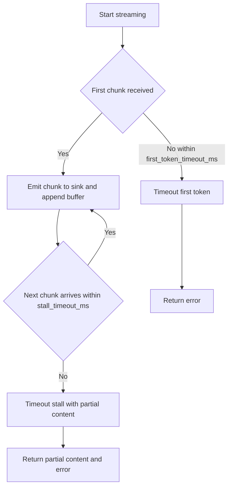
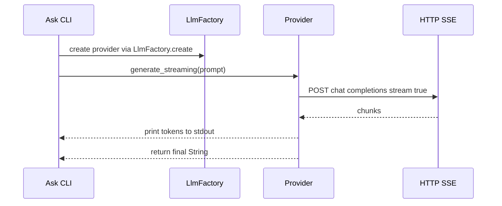

# OpenRouter provider, end-to-end streaming, reasoning controls, adaptive idle timeouts

## 1) Title, Status, Owners, Dates
- Title: OpenRouter provider, end-to-end streaming, reasoning controls, adaptive idle timeouts
- Status: Proposed
- Owners: Borg Core Engineering
- Created: 2025-09-10
- Target Merge: 2025-09-20

## 2) Problem Statement and Goals
The current LLM layer lacks OpenRouter support, consistent provider-agnostic streaming, granular reasoning and thinking controls, and robust adaptive idle-timeout handling. This RFC specifies the design to add these capabilities while preserving backward compatibility and repository standards.

Goals:
- OpenRouter provider support integrated via [LlmFactory::create()](src/code_generation/llm.rs:39) with OpenAI-compatible endpoints and headers.
- Provider-agnostic end-to-end streaming: keep [LlmProvider::generate_streaming()](src/code_generation/llm.rs:27) returning the final String while emitting per-chunk tokens to a sink suitable for the caller path.
- Reasoning/thinking controls: enable_thinking toggle, reasoning_effort, and reasoning_budget_tokens mapped per provider/model with safe degradation when unsupported.
- Adaptive idle-timeout behavior: enforce first-token timeout before the first chunk and stall timeout between chunks; do not time out while tokens are actively arriving.
- Apply streaming and timeout logic consistently across providers (OpenAI, Anthropic, new OpenRouter) and flows (Ask, Planning, Codegen) with proper logging via [LlmLogger::log_request()](src/code_generation/llm_logging.rs:69) and [LlmLogger::log_response()](src/code_generation/llm_logging.rs:104).

Non-goals / Out of scope:
- Any UI changes beyond token printing in the Ask CLI path [handle_ask_command()](src/main.rs:291).
- Adding new third-party dependencies beyond HTTP and serde already in use.
- Tool-call JSON protocol changes in code generation; token emission must not interleave with tool-call parsing in [LlmCodeGenerator::generate_with_tools()](src/code_generation/llm_generator.rs:214) and [LlmCodeGenerator::process_with_tools()](src/code_generation/llm_generator.rs:438).

## 3) Background and Current State
- Provider abstraction exists as [LlmProvider](src/code_generation/llm.rs:16) with [LlmProvider::generate()](src/code_generation/llm.rs:19) and [LlmProvider::generate_streaming()](src/code_generation/llm.rs:27).
- Provider factory [LlmFactory::create()](src/code_generation/llm.rs:39) supports "openai", "anthropic", and "mock".
- OpenAI provider implementations: [OpenAiProvider::new()](src/code_generation/llm.rs:67), [OpenAiProvider::generate()](src/code_generation/llm.rs:86), [OpenAiProvider::generate_streaming()](src/code_generation/llm.rs:190) (partial stream handling present).
- Anthropic provider implementations: [AnthropicProvider::new()](src/code_generation/llm.rs:333), [AnthropicProvider::generate()](src/code_generation/llm.rs:352), [AnthropicProvider::generate_streaming()](src/code_generation/llm.rs:434).
- Mock provider streaming: [MockLlmProvider::generate_streaming()](src/code_generation/llm.rs:644) prints tokens to stdout.
- Ask CLI drives streaming selection in [handle_ask_command()](src/main.rs:291).
- Code generation flow calls non-streaming paths today: [LlmCodeGenerator::new()](src/code_generation/llm_generator.rs:47), [LlmCodeGenerator::generate_with_tools()](src/code_generation/llm_generator.rs:214), [LlmCodeGenerator::process_with_tools()](src/code_generation/llm_generator.rs:438), [LlmCodeGenerator::create_commit_message()](src/code_generation/llm_generator.rs:563), [LlmCodeGenerator::generate_improvement()](src/code_generation/llm_generator.rs:655).
- Planning flow uses non-streaming calls with outer timeouts: [StrategicPlanningManager::get_llm_provider()](src/core/planning.rs:541), [StrategicPlanningManager::generate_strategic_plan_with_llm()](src/core/planning.rs:576), [StrategicPlanningManager::generate_milestones_for_objective()](src/core/planning.rs:762).
- Config currently defines [LlmConfig](src/core/config.rs:41) with provider, api_key, model, max_tokens, temperature. Testing helper: [Config::for_testing()](src/core/config.rs:360).
- Logging of request/response via [LlmLogger::log_request()](src/code_generation/llm_logging.rs:69) and [LlmLogger::log_response()](src/code_generation/llm_logging.rs:104).

Limitations:
- No OpenRouter provider.
- Streaming behavior and idle-timeout semantics are inconsistent and not codified for all providers.
- No generic reasoning/thinking controls at the config level.

## 4) Design Overview

4.1 OpenRouter provider
- Base URL: default api_base https://openrouter.ai/api/v1 (configurable per-llm via LlmConfig.api_base).
- Authentication header: Authorization: Bearer ${OPENROUTER_API_KEY}; optional headers forwarded via LlmConfig.headers map, including HTTP-Referer and X-Title when provided.
- Endpoint: OpenAI-compatible POST /chat/completions with stream=true for SSE; non-streaming uses the same endpoint without stream.
- Request message format mirrors OpenAI chat semantics; model is taken from LlmConfig.model (e.g., openrouter specific routing like openrouter/... forwarded).
- Error handling: HTTP non-2xx returns are parsed for body text; wrap in [BorgError](src/core/error.rs) with provider context; all requests/responses logged using [LlmLogger::log_request()](src/code_generation/llm_logging.rs:69)/[LlmLogger::log_response()](src/code_generation/llm_logging.rs:104).
- Location in code: Implement OpenRouterProvider near Anthropic provider in [src/code_generation/llm.rs](src/code_generation/llm.rs) and add "openrouter" arm in [LlmFactory::create()](src/code_generation/llm.rs:39).

4.2 Streaming interface
- Keep [LlmProvider::generate_streaming()](src/code_generation/llm.rs:27) signature returning Result&#60;String&#62;. The final returned String is the full concatenation of streamed tokens.
- Per-chunk emission via an internal sink:
  - Ask path: print tokens to stdout as they arrive (same behavior as [MockLlmProvider::generate_streaming()](src/code_generation/llm.rs:644)); no interleaving with other output.
  - Codegen and Planning: use a silent sink that accumulates into a buffer; the function still returns the final String without printing tokens.
- Sink selection:
  - Ask CLI selects streaming explicitly in [handle_ask_command()](src/main.rs:291); providers print to stdout in this path.
  - Other call sites continue to use [LlmProvider::generate()](src/code_generation/llm.rs:19) until later phases enable streaming with a silent sink.
- Tool-call safety: codegen’s parsing in [LlmCodeGenerator::generate_with_tools()](src/code_generation/llm_generator.rs:214) and [LlmCodeGenerator::process_with_tools()](src/code_generation/llm_generator.rs:438) must operate on the buffered final String; no incremental parsing of partial JSON.

4.3 Idle-timeout algorithm
- Introduce two timeouts in LlmConfig: first_token_timeout_ms and stall_timeout_ms.
- Behavior:
  - Before first chunk: if no bytes arrive within first_token_timeout_ms, return a TimeoutFirstToken error.
  - Between chunks: if gap between successive chunks exceeds stall_timeout_ms, return a TimeoutStall error with the partial content received.
  - While chunks arrive within stall_timeout_ms, ignore any overall timeout; a generous outer ceiling can remain only as a safeguard.
- Implementation sites:
  - OpenAI loop in [OpenAiProvider::generate_streaming()](src/code_generation/llm.rs:190) around the bytes_stream iteration.
  - Anthropic loop in [AnthropicProvider::generate_streaming()](src/code_generation/llm.rs:434).
  - New OpenRouter loop in its streaming implementation.
- Timer handling: record Instant of last_chunk; reset on each received chunk; check elapsed at non-blocking poll points.

4.4 Reasoning and thinking controls
- Add the following optional fields to [LlmConfig](src/core/config.rs:41):
  - enable_thinking: bool (default false)
  - reasoning_effort: enum "low" | "medium" | "high" (default null)
  - reasoning_budget_tokens: integer (default null)
- Provider mapping rules:
  - OpenAI: for models that support structured reasoning (e.g., o3, o4 mini), include a reasoning object with effort and optional budget; ignored by other models.
  - Anthropic: for thinking-capable models, include provider-specific fields (e.g., thinking enabled, budget_tokens); otherwise omit.
  - OpenRouter: pass-through compatible fields to upstream models; if unsupported, omit silently.
- Safe degradation: never send unsupported fields; do not fail the request due to unsupported reasoning controls.

4.5 Planning flow adjustments
- Prefer streaming with idle-timeout semantics and retain an outer generous tokio timeout only as a ceiling in [StrategicPlanningManager::generate_strategic_plan_with_llm()](src/core/planning.rs:576) and [StrategicPlanningManager::generate_milestones_for_objective()](src/core/planning.rs:762).
- This avoids premature cancellation while tokens are actively streaming.

4.6 Logging
- Keep request and response logs via [LlmLogger::log_request()](src/code_generation/llm_logging.rs:69) and [LlmLogger::log_response()](src/code_generation/llm_logging.rs:104).
- Optional: behind a debug flag, add chunk-level tracing with provider, model, token_count_so_far, and elapsed_since_last_chunk.

### Diagrams

Flowchart: adaptive idle-timeout handling in a streaming loop



Sequence: Ask path streaming and printing



## 5) Configuration Schema
Extend [LlmConfig](src/core/config.rs:41) with new optional fields and defaults.

Fields:
- provider: "openai" | "anthropic" | "openrouter" | "mock"
- api_base: string? default null; for "openrouter" default is https://openrouter.ai/api/v1
- headers: map[string]string? default null (forwarded as HTTP headers)
- enable_streaming: bool? default true for Ask CLI; false elsewhere unless set
- enable_thinking: bool? default false
- reasoning_effort: "low" | "medium" | "high"? default null
- reasoning_budget_tokens: int? default null
- first_token_timeout_ms: int? default 30000
- stall_timeout_ms: int? default 10000

TOML examples:

Default LLM (Ask):

```toml
[llm.default]
provider = "openrouter"
api_key = "${OPENROUTER_API_KEY}"
model = "openrouter/auto" # routes to a suitable model
max_tokens = 2048
temperature = 0.5
enable_streaming = true
enable_thinking = false
first_token_timeout_ms = 30000
stall_timeout_ms = 10000

[llm_logging]
log_dir = "logs/llm"
```

Code generation LLM:

```toml
[llm.code_generation]
provider = "openai"
api_key = "${OPENAI_API_KEY}"
model = "gpt-4o-mini"
max_tokens = 4096
temperature = 0.4
enable_streaming = false
enable_thinking = false
```

Planning LLM:

```toml
[llm.planning]
provider = "anthropic"
api_key = "${ANTHROPIC_API_KEY}"
model = "claude-3-7-sonnet"
max_tokens = 4096
temperature = 0.5
enable_streaming = true
enable_thinking = true
reasoning_budget_tokens = 8000
reasoning_effort = "medium"
first_token_timeout_ms = 45000
stall_timeout_ms = 15000
```

OpenRouter with custom headers:

```toml
[llm.default]
provider = "openrouter"
api_key = "${OPENROUTER_API_KEY}"
model = "openrouter/auto"
api_base = "https://openrouter.ai/api/v1"
headers = { HTTP-Referer = "https://yourapp.example", X-Title = "Borg CLI" }
enable_streaming = true
```

Environment variables:
- OPENROUTER_API_KEY used when [LlmFactory::create()](src/code_generation/llm.rs:39) selects provider "openrouter".
- OPENAI_API_KEY and ANTHROPIC_API_KEY as currently used.
- PLANNING_API_KEY remains a planning-specific fallback as in [StrategicPlanningManager::get_llm_provider()](src/core/planning.rs:541).

## 6) Detailed Change Map

src/code_generation/llm.rs
- Add an "openrouter" match arm in [LlmFactory::create()](src/code_generation/llm.rs:39).
- Implement OpenRouterProvider alongside Anthropic provider; include fields api_key, model, client, logger, api_base, headers.
- OpenAI and Anthropic providers: extend request builders in [OpenAiProvider::generate()](src/code_generation/llm.rs:86), [OpenAiProvider::generate_streaming()](src/code_generation/llm.rs:190), [AnthropicProvider::generate()](src/code_generation/llm.rs:352), [AnthropicProvider::generate_streaming()](src/code_generation/llm.rs:434) to conditionally inject reasoning/thinking fields when supported.
- Streaming loops: insert adaptive idle-timeout checks near [OpenAI stream loop](src/code_generation/llm.rs:265) and [Anthropic stream loop](src/code_generation/llm.rs:494); implement equivalent logic in the OpenRouter streaming loop.
- Ensure per-chunk emission prints to stdout only when invoked by Ask path; otherwise use silent accumulation.

src/core/config.rs
- Extend [LlmConfig](src/core/config.rs:41) with: api_base, headers, enable_streaming, enable_thinking, reasoning_effort, reasoning_budget_tokens, first_token_timeout_ms, stall_timeout_ms using #[serde(default)] helpers and sane defaults.
- Update [Config::for_testing()](src/core/config.rs:360) to populate the new fields for the mock config.

src/main.rs
- In [handle_ask_command()](src/main.rs:291): when --stream is not provided, honor llm.enable_streaming default; if true, call generate_streaming; else call generate. Keep token printing behavior for Ask.

src/code_generation/llm_generator.rs
- At [generate_with_tools()](src/code_generation/llm_generator.rs:214) and adjacent call sites: optional future enhancement to call generate_streaming with a silent sink while buffering for final parse; controlled by llm.enable_streaming.
- Maintain no console token output in codegen paths.

src/core/planning.rs
- Replace tight tokio::timeout wrappers at [598-602](src/core/planning.rs:598) and [789-793](src/core/planning.rs:789) with streaming plus provider-level idle-timeouts; optionally retain a generous outer ceiling.

src/code_generation/llm_logging.rs
- Optional: add a debug flag to enable chunk-level logging; leave [LlmLogger::log_request()](src/code_generation/llm_logging.rs:69) and [LlmLogger::log_response()](src/code_generation/llm_logging.rs:104) unchanged.

## 7) Error Handling and Observability
- Introduce new error variants in [BorgError](src/core/error.rs):
  - LlmTimeoutFirstToken { provider, model, elapsed_ms, request_id }
  - LlmTimeoutStall { provider, model, elapsed_ms, bytes_received, request_id }
- On timeout, include partial content length and last received timestamp in logs.
- Structured logs:
  - info: stream start, model, provider, enable_thinking, reasoning_effort, configured timeouts.
  - debug: chunk counts, cumulative bytes, inter-chunk latency.
  - warn/error: timeout or API errors with HTTP status and message body excerpt.

## 8) Backward Compatibility and Migration
- Defaults preserve current behavior: non-streaming calls continue to work; providers ignore unsupported reasoning fields.
- Ask CLI streaming is enabled by default via config but remains opt-in for users; --stream flag continues to force streaming.
- Mock behavior unchanged unless streaming is enabled; can be extended for testing without impacting production providers.
- Config files without new fields continue to parse due to #[serde(default)].

## 9) Testing Plan
Unit tests:
- Factory instantiation selects OpenRouter when provider="openrouter" in [LlmFactory::create()](src/code_generation/llm.rs:39).
- Streaming idle-timeout logic: simulated streams trigger first-token and stall timeouts; ensure correct error variants emitted.
- Reasoning payload injection:
  - OpenAI reasoning object present for o3/o4 class when enable_thinking=true; absent otherwise.
  - Anthropic thinking fields present when supported; absent otherwise.
  - OpenRouter forwards supported fields.

Mock extensions:
- Enhance [MockLlmProvider::generate_streaming()](src/code_generation/llm.rs:644) to optionally simulate:
  - first token delay
  - mid-stream stall
  - optional thinking prelude segments
- Control via special prompt markers or additional mock settings.

Integration tests:
- CLI Ask with --stream using BORG_USE_MOCK_LLM=true to validate printing and final String content.
- Planning streaming validates idle-timeout semantics under simulated stalls.
- Codegen roundtrip confirms no token interleaving with tool-call parsing and correct final buffer capture.

## 10) Rollout Plan and Risks
Phased rollout:
- Phase 1: Extend [LlmConfig](src/core/config.rs:41) and implement OpenRouter provider; add factory arm.
- Phase 2: Implement adaptive idle-timeouts in OpenAI, Anthropic, OpenRouter streaming loops.
- Phase 3: Enable streaming by default in Ask via config; keep non-streaming in codegen/planning.
- Phase 4: Optional: enable streaming internally for planning and codegen with silent sink; measure stability before defaulting on.

Risks and mitigations:
- Model-specific parameter drift: confine reasoning field mappings behind provider adapters; ignore unsupported fields.
- Excessive timeouts during active streams: rely on stall-timeout semantics and generous outer ceilings.
- Log volume with chunk-level debug: guard behind a debug flag.
- Streaming parsing issues for tool calls: keep buffering and parse only final String in codegen flows.

Appendix: Provider-specific parameter mapping examples

OpenAI (o3/o4 family) example payload fields:

```json
{
  "reasoning": {
    "effort": "medium",
    "budget_tokens": 8000
  }
}
```

Anthropic thinking example fields:

```json
{
  "thinking": {
    "enabled": true,
    "budget_tokens": 8000
  }
}
```

OpenRouter pass-through note:
- When provider="openrouter", include fields compatible with the routed model family; omit otherwise.

End of RFC.